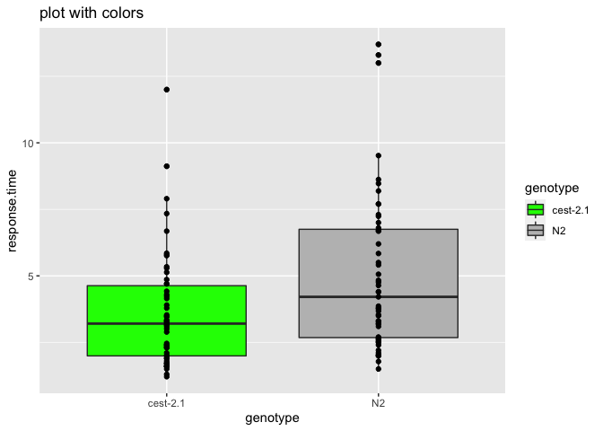
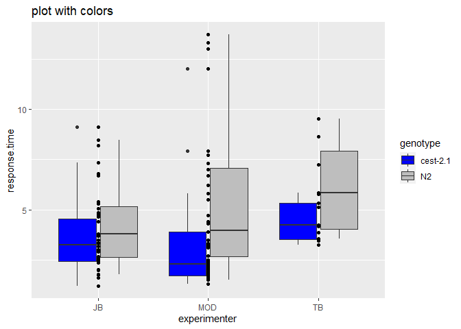

Analysis of the 30% octanol avoidance phenotypes of cest-2.1


```r
library(tidyverse)
```

```
## ── Attaching packages ─────────────────────────────────────── tidyverse 1.3.1 ──
```

```
## ✓ ggplot2 3.3.5     ✓ purrr   0.3.4
## ✓ tibble  3.1.6     ✓ dplyr   1.0.7
## ✓ tidyr   1.1.4     ✓ stringr 1.4.0
## ✓ readr   2.1.1     ✓ forcats 0.5.1
```

```
## ── Conflicts ────────────────────────────────────────── tidyverse_conflicts() ──
## x dplyr::filter() masks stats::filter()
## x dplyr::lag()    masks stats::lag()
```

```r
oct_avoid <- read_csv("octanol_avoidance_merged.csv")
```

```
## Rows: 105 Columns: 5
```

```
## ── Column specification ────────────────────────────────────────────────────────
## Delimiter: ","
## chr (4): genotype, odor, experimenter, date
## dbl (1): response.time
```

```
## 
## ℹ Use `spec()` to retrieve the full column specification for this data.
## ℹ Specify the column types or set `show_col_types = FALSE` to quiet this message.
```


```r
oct_avoid %>% glimpse()
```

```
## Rows: 105
## Columns: 5
## $ genotype      <chr> "N2", "N2", "N2", "N2", "N2", "N2", "N2", "N2", "N2", "N…
## $ odor          <chr> "30pct_oct", "30pct_oct", "30pct_oct", "30pct_oct", "30p…
## $ response.time <dbl> 2.1, 3.1, 3.5, 3.2, 3.2, 2.7, 7.0, 13.0, 6.7, 2.2, 2.4, …
## $ experimenter  <chr> "MOD", "MOD", "MOD", "MOD", "MOD", "MOD", "MOD", "MOD", …
## $ date          <chr> "8/5/2021", "8/5/2021", "8/5/2021", "8/5/2021", "8/5/202…
```

Plotted by Genotype

```r
oct_avoid %>%
  ggplot(aes(x = genotype, y = response.time)) +
  geom_boxplot(aes(fill = genotype)) +
  geom_point() +
  labs(title = "plot with colors") +
  scale_fill_manual(values = c("green", "grey"))
```

<!-- -->
Plotted by Experimenter

```r
oct_avoid %>%
  ggplot(aes(x = experimenter, y = response.time)) +
  geom_boxplot(aes(fill = genotype)) +
  geom_point() +
  labs(title = "plot with colors") +
  scale_fill_manual(values = c("blue", "grey"))
```

<!-- -->


